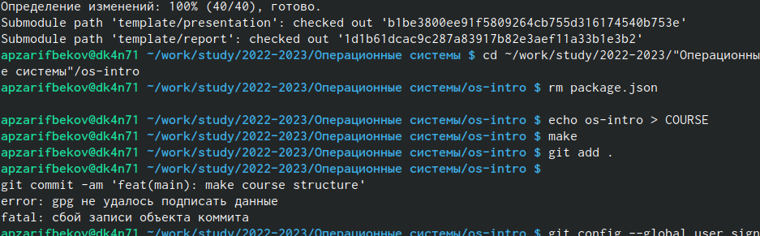

---
## Front matter
lang: ru-RU
title: Лаборатрная рабта №2
subtitle: Простейший шаблон
author:
  - Зарифбеов А.П.
institute:
  - Российский университет дружбы народов, Москва, Россия
  - 
date: 

## i18n babel
babel-lang: russian
babel-otherlangs: english

## Formatting pdf
toc: false
toc-title: Содержание
slide_level: 2
aspectratio: 169
section-titles: true
theme: metropolis
header-includes:
 - \metroset{progressbar=frametitle,sectionpage=progressbar,numbering=fraction}
 - '\makeatletter'
 - '\beamer@ignorenonframefalse'
 - '\makeatother'
---

# Информация

## Докладчик

  * Зарифбеов Амир  Пайшанбивеч 
  * Студент НБИбд-01-22
  * Российский университет дружбы народов
 

## Актуальность
Лабораторная работа актуальна для тех, кто желаем освоить GitHub.

## Объект и предмет исследования

- Презентация как текст
- Программное обеспечение для создания презентаций
- Входные и выходные форматы презентаций

## Цели и задачи

- Изучить идеологию и применение средств контроля версий.
- Освоить умения по работе с git.
- Создать базовую конфигурацию для работы с git.
- Создать ключ SSH.
- Создать ключ PGP.
- Настроить подписи git.
- Зарегистрироваться на Github.
- Создать локальный каталог для выполнения заданий по предмету.

## Содержание исследования

1. Базовая настройка git. (рис. [-@fig:001])

{#fig:001 width=90%}

##

2. Создаем ключи SSH. (рис. [-@fig:002])

{#fig:002 width=90%}

##

3. Создаем ключ PGP. (рис. [-@fig:003])

{#fig:003 width=90%}

##

4. Добавляем PGP ключ в GitHub. (рис. [-@fig:004]) 

{#fig:004width=90%}

##

5. Копируем сгенерированный PGP ключ в буфер обмена. (рис. [-@fig:005])

{#fig:005 width=90%}

##

6. Настраиваем каталог курса. (рис. [-@fig:007])

{#fig:006 width=90%}

##

7. Отправляем файлы на сервер. (рис. [-@fig:008])

{#fig:007 width=90%}

##

8. Проверяем работу. (рис. [-@fig:009])

{#fig:008 width=90%}

    

## Результаты

- Настроили GitHub 
- Создали ключи

## Итоговый слайд

- В ходе выполнения лабораторной работы, мы изучили идеологию и применение средств контроля версий и освоили умения работать с git.

