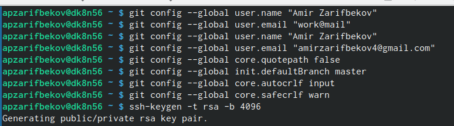
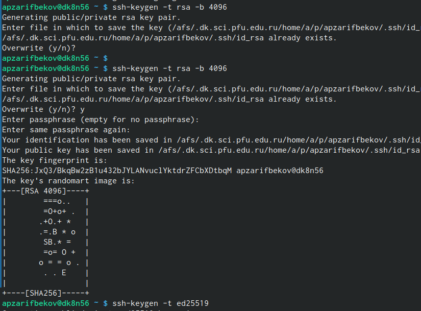
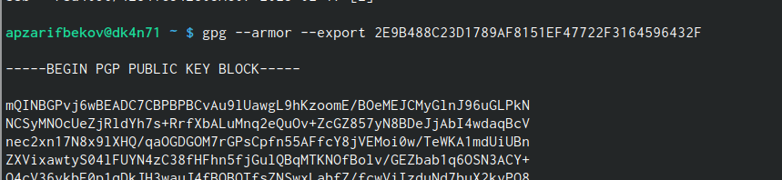
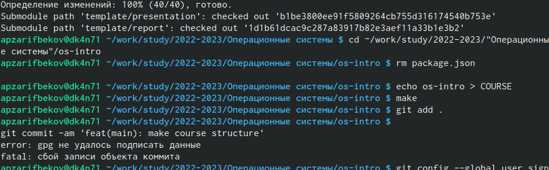
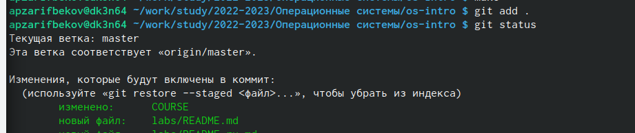
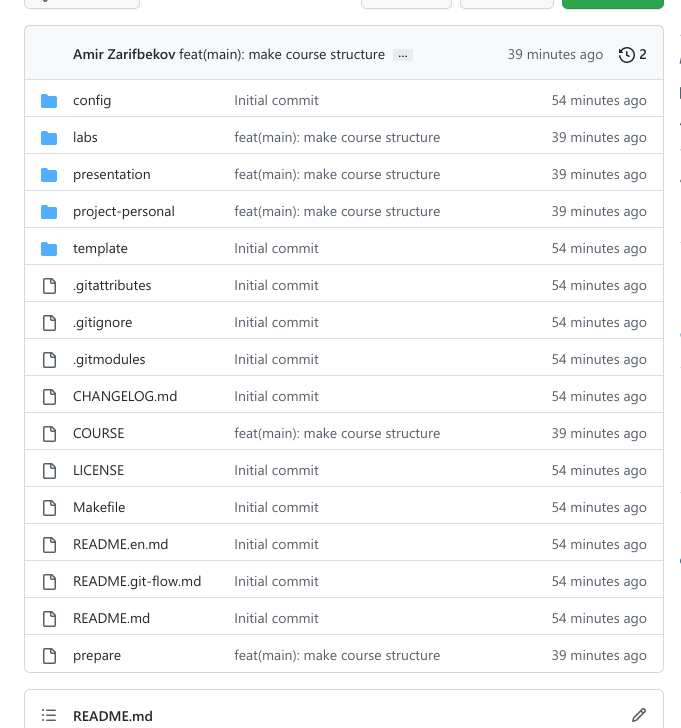

---
## Front matter
lang: ru-RU
title: Лаборатрная рабта №3
subtitle: Markdown
author:
  - Зарифбеков А.П.
institute:
  - Российский университет дружбы народов, Москва, Россия
  - 
date: 22 февраля 2023

## i18n babel
babel-lang: russian
babel-otherlangs: english

## Formatting pdf
toc: false
toc-title: Содержание
slide_level: 2
aspectratio: 169
section-titles: true
theme: metropolis
header-includes:
 - \metroset{progressbar=frametitle,sectionpage=progressbar,numbering=fraction}
 - '\makeatletter'
 - '\beamer@ignorenonframefalse'
 - '\makeatother'
---

# Информация

## Докладчик

  * Зарифбеков Амир Пайшанбиевич
  *  Студент НБИбд-01-22
  * Российский университет дружбы народов

## Актуальность

Лабораторная работа актуальна для тех, кто желаем освоить Markdown

## Объект и предмет исследования

- Презентация как текст
- Программное обеспечение для создания презентаций
- Входные и выходные форматы презентаций

## Цели и задачи

- Научиться оформлять отчёты с помощью легковесного языка разметки Markdown
- Сделайте отчёт по предыдущей лабораторной работе в формате Markdown.

## Содержание исследования
1. Базовая настройка git.

{#fig:001 width=90%}

##

2. Создаем ключи SSH. 

{#fig:002 width=90%}

##

3. Создаем ключ PGP. 

{#fig:003 width=90%}

##

4. Добавляем PGP ключ в GitHub.

{#fig:004width=90%}

##

5. Копируем сгенерированный PGP ключ в буфер обмена.

{#fig:005 width=90%}

##

6. Настраиваем каталог курса.

{#fig:006 width=90%}

##

7. Отправляем файлы на сервер. 

{#fig:007 width=90%}

##

8. Проверяем работу. 
{#fig:008 width=90%}

    

## Результаты

- Не нужны все результаты
- Необходимы логические связки между слайдами
- Необходимо показать понимание материала

## Итоговый слайд

- Запоминается последняя фраза. © Штирлиц
- Главное сообщение, которое вы хотите донести до слушателей
- Избегайте использовать последний слайд вида *Спасибо за внимание*

# Рекомендации

## Принцип 10/20/30

  - 10 слайдов
  - 20 минут на доклад
  - 30 кегль шрифта

## Связь слайдов

::: incremental

- Один слайд --- одна мысль
- Нельзя ссылаться на объекты, находящиеся на предыдущих слайдах (например, на формулы)
- Каждый слайд должен иметь заголовок

:::

## Количество сущностей

::: incremental

- Человек может одновременно помнить $7 \pm 2$ элемента
- При размещении информации на слайде старайтесь чтобы в сумме слайд содержал не более 5 элементов
- Можно группировать элементы так, чтобы визуально было не более 5 групп

:::

## Общие рекомендации

::: incremental

- На слайд выносится та информация, которая без зрительной опоры воспринимается хуже
- Слайды должны дополнять или обобщать содержание выступления или его частей, а не дублировать его
- Информация на слайдах должна быть изложена кратко, чётко и хорошо структурирована
- Слайд не должен быть перегружен графическими изображениями и текстом
- Не злоупотребляйте анимацией и переходами

:::

## Представление данных

::: incremental

- Лучше представить в виде схемы
- Менее оптимально представить в виде рисунка, графика, таблицы
- Текст используется, если все предыдущие способы отображения информации не подошли

:::

