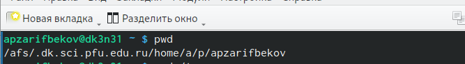
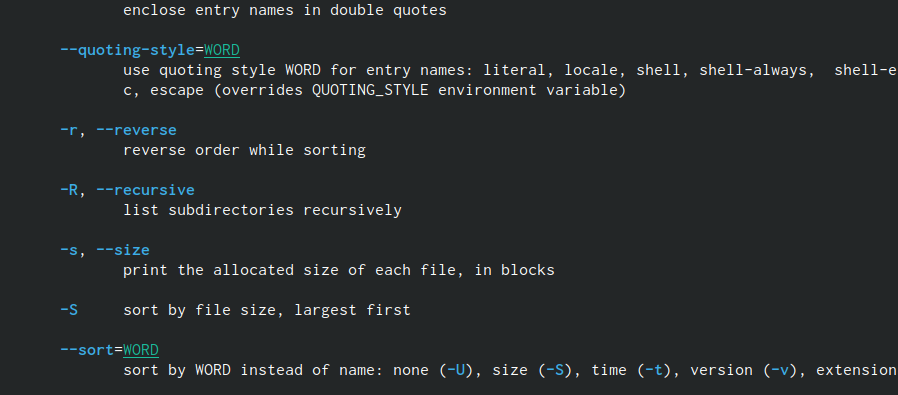

---
## Front matter
lang: ru-RU
title: Лабораторная работа №4
subtitle: Основы интерфейса взаимодействия пользователя с системой Unix на уровне командной строки
author:
  - Зарифбеков А. П.
institute:
  - Российский университет дружбы народов, Москва, Россия
date: 02 марта 2023

## i18n babel
babel-lang: russian
babel-otherlangs: english

## Formatting pdf
toc: false
toc-title: Содержание
slide_level: 2
aspectratio: 169
section-titles: true
theme: metropolis
header-includes:
 - \metroset{progressbar=frametitle,sectionpage=progressbar,numbering=fraction}
 - '\makeatletter'
 - '\beamer@ignorenonframefalse'
 - '\makeatother'
---

# Информация

## Докладчик

  * Зарифбеков Амир Пайшанбиевич
  *  Студент НБИбд-01-22
  * Российский университет дружбы народов

## Актуальность

Данная лабораторная работа актуальна для тех кто хочет приобрести практические навыки взаимодествия сиситемы с командной стркои

## Объект и предмет исследования

- Презентация как текст
- Программное обеспечение для создания презентаций
- Входные и выходные форматы презентаций

## Цели и задачи

- Приобретение практических навыков взаимодействия пользователя с системой по-
средством командной строки

- Определите полное имя вашего домашнего католога.

- Перейдём в католог /tmp и выполняем там заданные команды.

- В домашнем каталоге создайте новый каталог с именем newdir,etters, memos, misk,morefun

- С помощью команды man определите, какую опцию команды ls нужно использо-
вать для просмотра содержимое не только указанного каталога, но и подкаталогов,
входящих в него.

- С помощью команды man определите набор опций команды ls, позволяющий отсорти-
ровать по времени последнего изменения выводимый список содержимого каталога
с развёрнутым описанием файлов.

- Используйте команду man для просмотра описания следующих команд: cd, pwd, mkdir,
rmdir, rm. Поясните основные опции этих команд.

- Используя информацию, полученную при помощи команды history, выполните мо-
дификацию и исполнение нескольких команд из буфера коман

## Содержание исследования

1. Определяем полное имя нешего домашнего католога.

{#fig:001 width=70%}

##

2. Перейдём к в католог tmp.Вывед на экран содержимое каталога /tmp. Определим, есть ли в каталоге /var/spool подкаталог с именем cron? Перейдём в наш домашний каталог и выведем на экран его содержимое.

{#fig:002 width=70%}

##

3. В домашнем каталоге создайте новый каталог с именем newdir,etters, memos, misk,morefun. После их создания удаляем эти катологи .

{#fig:003 width=70%}

## 

{#fig:004 width=70%}

##

4. С помощью команды man определим, какую опцию команды ls нужно использовать для просмотра содержимое не только указанного каталога, но и подкаталогов,входящих в него.

{#fig:005 width=70%}

##

5. С помощью команды man определим набор опций команды ls, позволяющий отсортировать по времени последнего изменения выводимый список содержимого каталога с развёрнутым описанием файлов.

{#fig:006 width=70%} 

##

6. Используем команду man для просмотра описания следующих команд: cd, pwd, mkdir,rmdir, rm. 

{#fig:007 width=70%} 

##

{#fig:008 width=70%} 

##

{#fig:009 width=70%}

##

{#fig:010 width=70%} 

##

{#fig:011 width=70%} 
 
##
 
 
7. Используя информацию, полученную при помощи команды history, выполним модификацию и исполнение нескольких команд из буфера команд.

{#fig:012 width=70%} 

##

{#fig:01 width=70%} 

## Результаты

Я пртобоёл практические навыки взаимодействия пользователя с системой посредством командной строки.

## Итоговый слайд

- Определили полное имя вашего домашнего католога.

- Перешёл в католог /tmp и выполняем там заданные команды.

- В домашнем каталоге создал новый каталог с именем newdir,etters, memos, misk,morefun

- С помощью команды man определил, какую опцию команды ls нужно использо-
вать для просмотра содержимое не только указанного каталога, но и подкаталогов,
входящих в него.

- С помощью команды man определил набор опций команды ls, позволяющий отсорти-
ровать по времени последнего изменения выводимый список содержимого каталога
с развёрнутым описанием файлов.

- Используйя команду man для просмотра описания следующих команд: cd, pwd, mkdir,
rmdir, rm. Пояснил основные опции этих команд.

- Используя информацию, полученную при помощи команды history, выполнил мо-
дификацию и исполнение нескольких команд из буфера коман

