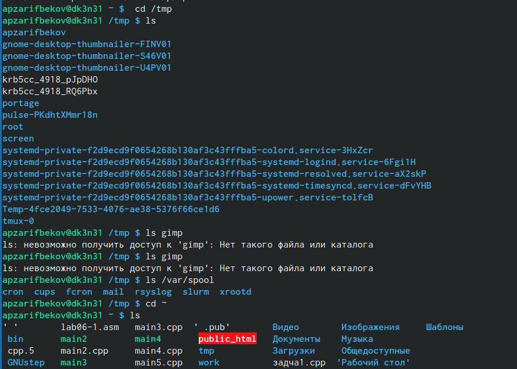
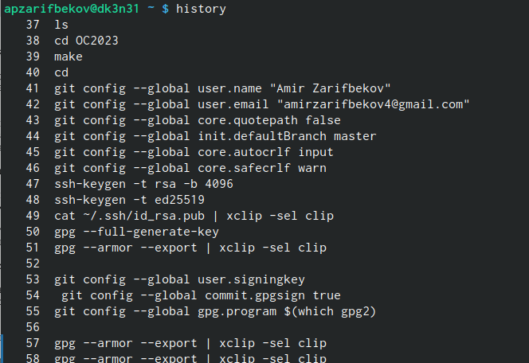

---
## Front matter
title: "Лабораторная работа No 4"
subtitle: "Основы интерфейса взаимодействия
пользователя с системой Unix на уровне командной строки"
author: "Зарифбеков Амир пайшанбиевич"

## Generic otions
lang: ru-RU
toc-title: "Содержание"

## Bibliography
bibliography: bib/cite.bib
csl: pandoc/csl/gost-r-7-0-5-2008-numeric.csl

## Pdf output format
toc: true # Table of contents
toc-depth: 2
lof: true # List of figures
lot: true # List of tables
fontsize: 12pt
linestretch: 1.5
papersize: a4
documentclass: scrreprt
## I18n polyglossia
polyglossia-lang:
  name: russian
  options:
	- spelling=modern
	- babelshorthands=true
polyglossia-otherlangs:
  name: english
## I18n babel
babel-lang: russian
babel-otherlangs: english
## Fonts
mainfont: PT Serif
romanfont: PT Serif
sansfont: PT Sans
monofont: PT Mono
mainfontoptions: Ligatures=TeX
romanfontoptions: Ligatures=TeX
sansfontoptions: Ligatures=TeX,Scale=MatchLowercase
monofontoptions: Scale=MatchLowercase,Scale=0.9
## Biblatex
biblatex: true
biblio-style: "gost-numeric"
biblatexoptions:
  - parentracker=true
  - backend=biber
  - hyperref=auto
  - language=auto
  - autolang=other*
  - citestyle=gost-numeric
## Pandoc-crossref LaTeX customization
figureTitle: "Рис."
tableTitle: "Таблица"
listingTitle: "Листинг"
lofTitle: "Список иллюстраций"
lotTitle: "Список таблиц"
lolTitle: "Листинги"
## Misc options
indent: true
header-includes:
  - \usepackage{indentfirst}
  - \usepackage{float} # keep figures where there are in the text
  - \floatplacement{figure}{H} # keep figures where there are in the text
---

# Цель работы

Приобретение практических навыков взаимодействия пользователя с системой по-
средством командной строки

# Задание

1. Определите полное имя вашего домашнего католога.
2. Перейдём в католог /tmp и выполняем там заданные команды.
3. В домашнем каталоге создайте новый каталог с именем newdir,etters, memos, misk,morefun
4. С помощью команды man определите, какую опцию команды ls нужно использо-
вать для просмотра содержимое не только указанного каталога, но и подкаталогов,
входящих в него.
5. С помощью команды man определите набор опций команды ls, позволяющий отсорти-
ровать по времени последнего изменения выводимый список содержимого каталога
с развёрнутым описанием файлов.
6. Используйте команду man для просмотра описания следующих команд: cd, pwd, mkdir,
rmdir, rm. Поясните основные опции этих команд.
7. Используя информацию, полученную при помощи команды history, выполните мо-
дификацию и исполнение нескольких команд из буфера коман

# Выполнение лабораторной работы

1. Определяем полное имя нешего домашнего католога.

{#fig:001 width=70%}

2. Перейдём к в католог tmp.Вывед на экран содержимое каталога /tmp. Определим, есть ли в каталоге /var/spool подкаталог с именем cron? Перейдём в наш домашний каталог и выведем на экран его содержимое.

{#fig:002 width=70%}

3. В домашнем каталоге создайте новый каталог с именем newdir,etters, memos, misk,morefun. После их создания удаляем эти катологи .

{#fig:003 width=70%}

{#fig:004 width=70%}

4. С помощью команды man определим, какую опцию команды ls нужно использовать для просмотра содержимое не только указанного каталога, но и подкаталогов,входящих в него.

{#fig:005 width=70%}

5. С помощью команды man определим набор опций команды ls, позволяющий отсортировать по времени последнего изменения выводимый список содержимого каталога с развёрнутым описанием файлов.

{#fig:006 width=70%} 

6. Используем команду man для просмотра описания следующих команд: cd, pwd, mkdir,rmdir, rm. 

{#fig:007 width=70%} 

{#fig:008 width=70%} 

{#fig:009 width=70%}

{#fig:010 width=70%} 

{#fig:011 width=70%} 
 
7. Используя информацию, полученную при помощи команды history, выполним модификацию и исполнение нескольких команд из буфера команд.

{#fig:012 width=70%} 

{#fig:01 width=70%} 

#   Ответы на контрольные вопросы

1. Что такое командная строка - инструмент для передачи дейтвий которые должен выполнить компьютерю
2. pwd, realpath

3. ls -F

4. Можно отредактировать скрытый файл и заметить что он отображается, в данном случае стоит использовать ls, а точнее ls -a.
 Пример: ls -a. Вывод: . ..

5. При помощи rm, rmdir можно удалить файл и каталог, можно это сделать
одной и той же командой. 
Пример: rm -r letters memos misk
Пример: rmdir -r letters memos misk

6. history

7. Пример: "!501:s/i/l". Выбираем строчку, пишем её номер в начале, далее команду которую хотим заменить на следующую.

8. Используем запятые для того чтобы записать сразу несколько командю

9. Экранирование - способ заключения в кавычки одиночного символа. Экранируемый символ (\) сообщает интерпретатору, что следующий за этим символ воспринимается как обычный символ.
Пример: "echo "Мир: \"world\"." # echo "Мир: \"world\".

10. Охарактеризуйте вывод информации на экран после выполнения команды ls с опцией

11. Относительный путь к файлу - это путь к файлу относительно текущей папки. Например, при использовании pwd.

12. Получить информацию об интересующей вас команде можно с помощью команды man. 
Man ls выдаёт все варианты действий с комнадой.

13. Сочетание клавиш Ctr+C прерывает текущий процесс, запущенный в терминале.

# Выводы

Я пртобоёл практические навыки взаимодействия пользователя с системой посредством командной строки.

::: {#refs}
:::
