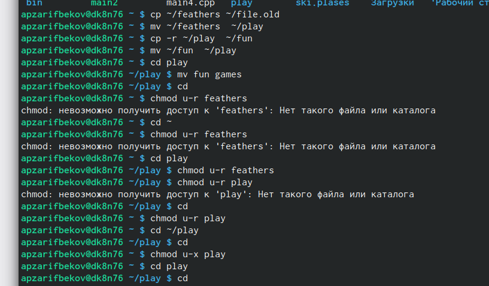

---
## Front matter
lang: ru-RU
title: Лабораторная работа №5
subtitle: Основы интерфейса взаимодействия пользователя с системой Unix на уровне командной строки
author:
  - Зарифбеков А. П.
institute:
  - Российский университет дружбы народов, Москва, Россия
date: 02 марта 2023

## i18n babel
babel-lang: russian
babel-otherlangs: english

## Formatting pdf
toc: false
toc-title: Содержание
slide_level: 2
aspectratio: 169
section-titles: true
theme: metropolis
header-includes:
 - \metroset{progressbar=frametitle,sectionpage=progressbar,numbering=fraction}
 - '\makeatletter'
 - '\beamer@ignorenonframefalse'
 - '\makeatother'
---

# Информация

## Докладчик

  * Зарифбеков Амир Пайшанбиевич
  *  Студент НБИбд-01-22
  * Российский университет дружбы народов

## Актуальность

Даёт ознакомится  с файловой системой Linux, её структурой, именами и содержанием

## Цели и задачи

Ознакомление с файловой системой Linux, её структурой, именами и содержанием
каталогов. Приобретение практических навыков по применению команд для работы
с файлами и каталогами, по управлению процессами (и работами), по проверке исполь-
зования диска и обслуживанию файловой системы

## Материалы и методы

- Представляйте данные качественно
- Количественно, только если крайне необходимо
- Излишние детали не нужны

## Содержание исследования

1. Выполнил все примеры, приведённые в первой части описания лабораторной работы

{#fig:001 width=70%}

##

2.  Выполните следующие действия,Скопируйте файл /usr/include/sys/io.h в домашний каталог и будем проводит сним разные операции с помошью команд mv и cp

{#fig:002 width=70%}

##

3.  Определим опции команды chmod

{#fig:003 width=70%}

##

{#fig:004 width=70%}

##

{#fig:005 width=70%}

##

{#fig:006 width=70%}

##

4. Далее мы взоимодействуем с  файлом feathers перемещаем её переиминовываем и всячески взоимодействуем с ним. 
 
{#fig:007 width=70%}

##

5. Прочитаем man по командам mount, fsck, mkfs, kill 

{#fig:008 width=70%}

##

{#fig:009 width=70%}

##

{#fig:010 width=70%}

##

{#fig:011 width=70%}

##

{#fig:012 width=70%}

## Результаты

Ознакомился с файловой системой Linux, её структурой, именами и содержанием
каталогов. Приобрёл практические навыки по применению команд для работы
с файлами и каталогами, по управлению процессами (и работами), по проверке исполь-
зования диска и обслуживанию файловой системы

