---
## Front matter
lang: ru-RU
title: Лабораторная работа №6
subtitle: Поиск файлов. Перенаправление ввода-вывода. Просмотр запущенных процессов
author:
  - Зарифбеков А. П.
institute:
  - Российский университет дружбы народов, Москва, Россия
date: 15 марта 2023

## i18n babel
babel-lang: russian
babel-otherlangs: english

## Formatting pdf
toc: false
toc-title: Содержание
slide_level: 2
aspectratio: 169
section-titles: true
theme: metropolis
header-includes:
 - \metroset{progressbar=frametitle,sectionpage=progressbar,numbering=fraction}
 - '\makeatletter'
 - '\beamer@ignorenonframefalse'
 - '\makeatother'
---

# Информация

## Докладчик

  * Зарифбеков Амир Пайшанбиевич
  *  Студент НБИбд-01-22
  * Российский университет дружбы народов

## Актуальность

 Актуальна для тех кто хочет начучится работать с поиском файлов,с перенаправлением ввода-вывода, просмотром запущенных процессоров. 
 
## Объект и предмет исследования

- Презентация как текст
- Программное обеспечение для создания презентаций
- Входные и выходные форматы презентаций

## Цели и задачи

- Ознакомление с инструментами поиска файлов и фильтрации текстовых данных.
Приобретение практических навыков: по управлению процессами (и заданиями), по
проверке использования диска и обслуживанию файловых систем
- Осуществите вход в систему, используя соответствующее имя пользователя.
- Запишите в файл file.txt названия файлов, содержащихся в каталоге /etc. Допи-
шите в этот же файл названия файлов, содержащихся в вашем домашнем каталоге.
- Выведите имена всех файлов из file.txt, имеющих расширение .conf, после чего
запишите их в новый текстовой файл conf.txt.
- Определите, какие файлы в вашем домашнем каталоге имеют имена, начинавшиеся
с символа c? Предложите несколько вариантов, как это сделать.
- Выведите на экран (по странично) имена файлов из каталога /etc, начинающиеся
с символа h.
- Запустите в фоновом режиме процесс, который будет записывать в файл ~/logfile
файлы, имена которых начинаются с log.
- Удалите файл ~/logfile.
- Запустите из консоли в фоновом режиме редактор gedit.
- Определите идентификатор процесса gedit, используя команду ps, конвейер и фильтр
grep. Как ещё можно определить идентификатор процесса?
- Прочтите справку (man) команды kill, после чего используйте её для завершения
процесса gedit.
- Выполните команды df и du, предварительно получив более подробную информацию
об этих командах, с помощью команды man.
- Воспользовавшись справкой команды find, выведите имена всех директорий, имею-
щихся в вашем домашнем каталоге
## Содержание исследования

1. Запишем в файл file.txt названия файлов, содержащихся в каталоге /etc. Допи-
шим в этот же файл названия файлов, содержащихся в вашем домашнем каталоге.

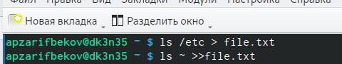{#fig:001 width=70%}

##

2. Выведем имена всех файлов из file.txt, имеющих расширение .conf, после чего
запишем их в новый текстовой файл conf.txt.

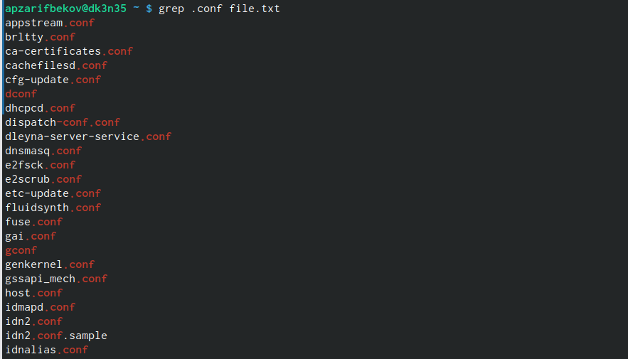{#fig:002 width=70%}

##

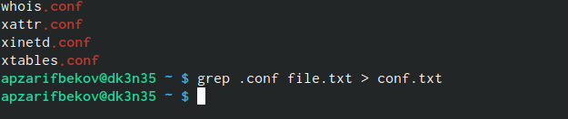{#fig:021 width=70%}

##

3. Определим, какие файлы в вашем домашнем каталоге имеют имена, начинавшиеся с символа c.

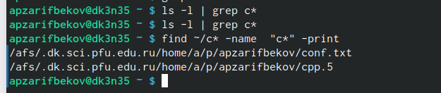{#fig:003 width=70%}

##

4. Выведем на экран (по странично) имена файлов из каталога /etc, начинающиеся с символа h.
 
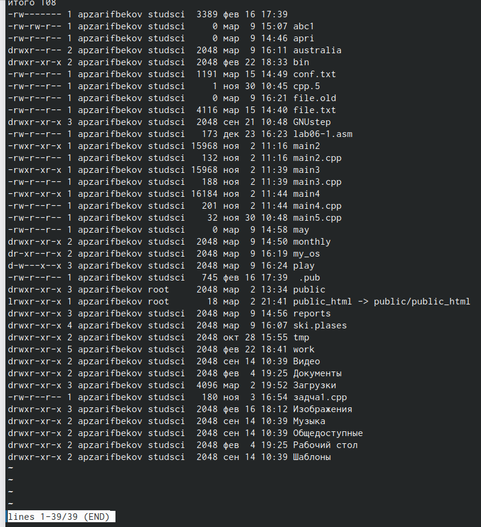{#fig:004 width=70%}

##

5. Запустим в фоновом режиме процесс, который будет записывать в файл ~/logfile
файлы, имена которых начинаются с log.

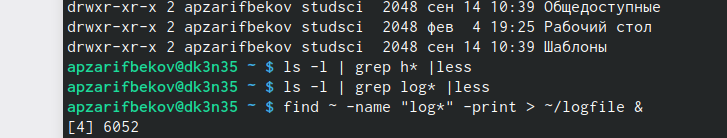{#fig:005 width=70%}
##

6. Удаляем файл ~/logfile.

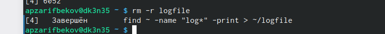{#fig:006 width=70%}

##

7. Запустим из консоли в фоновом режиме редактор gedit

{#fig:007 width=70%}

##

8. Определим идентификатор процесса gedit, используя команду ps, конвейер и фильтр grep.

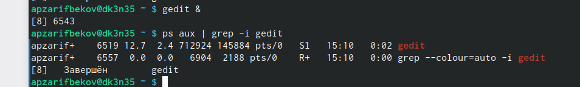{#fig:008 width=70%}

##

9. Прочту справку (man) команды kill, после чего используйте её для завершения процесса gedit.
 
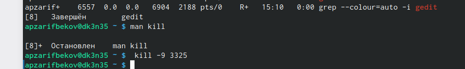{#fig:009 width=70%}

##

10. Выполню  команды df и du, предварительно получив более подробную информацию об этих командах, с помощью команды man.

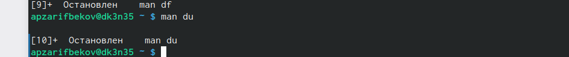{#fig:010 width=70%}

##

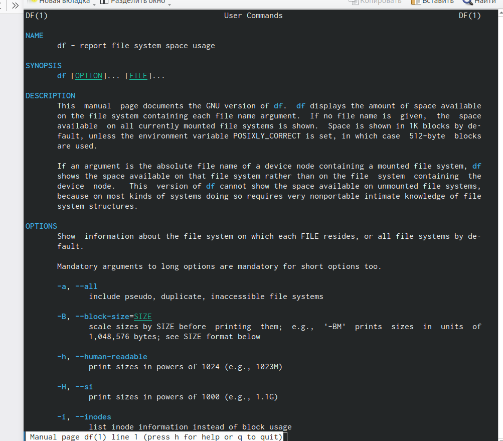{#fig:101 width=70%}

##

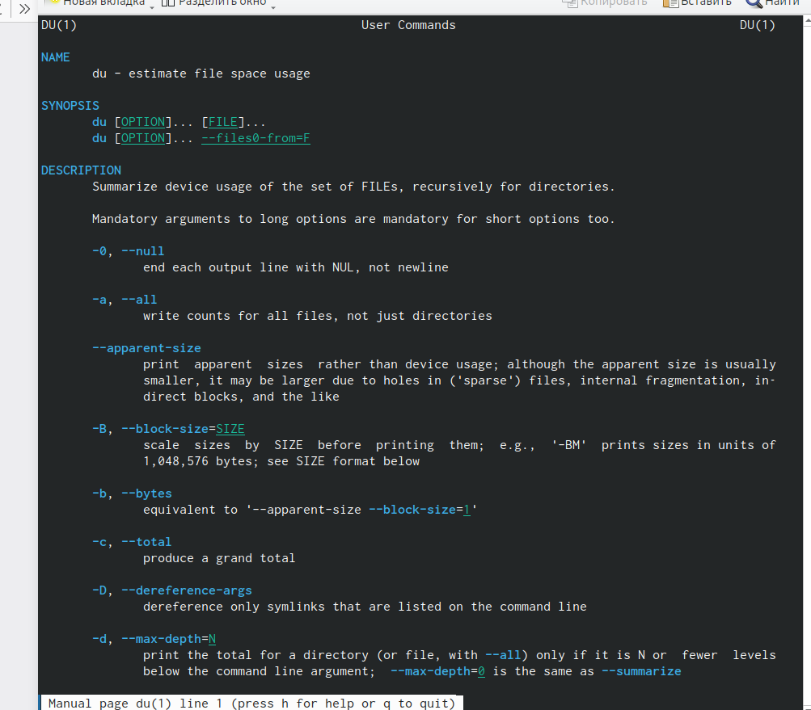{#fig:102 width=70%}

##

11. Воспользовавшись справкой команды find, выведите имена всех директорий, имею-щихся в вашем домашнем каталоге

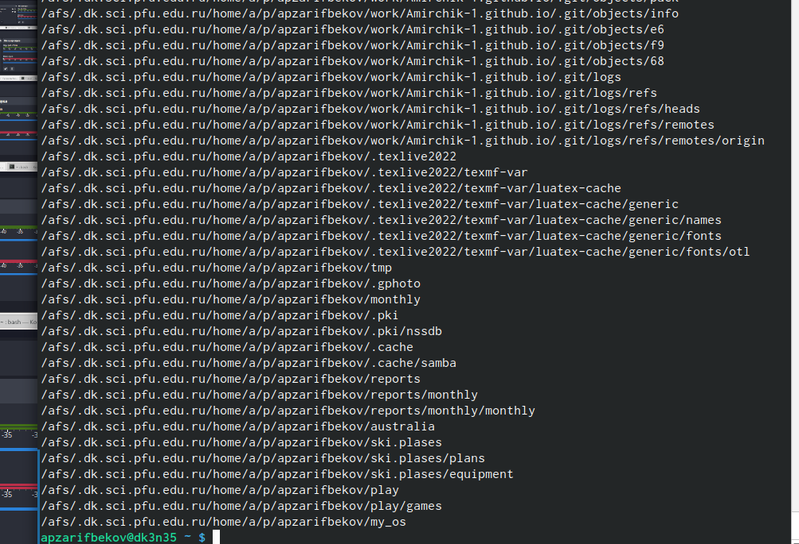{#fig:011 width=70

## Результаты

Ознакомился с инструментами поиска файлов и фильтрации текстовых данных. Приобрёл практические навыки: по управлению процессами (и заданиями), по проверке использования диска и обслуживанию файловых систем.

