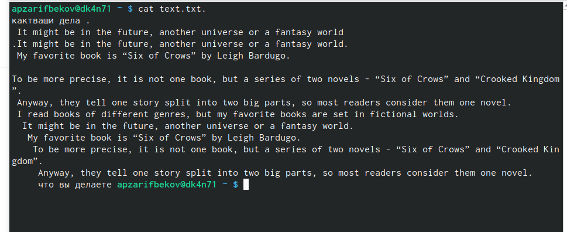

---
## Front matter
lang: ru-RU
title: Лабораторная работа №7
subtitle: Командная оболочка Midnight Commander
author:
  - Зарифбеков А. П.
institute:
  - Российский университет дружбы народов, Москва, Россия
date: 22 марта 2023

## i18n babel
babel-lang: russian
babel-otherlangs: english

## Formatting pdf
toc: false
toc-title: Содержание
slide_level: 2
aspectratio: 169
section-titles: true
theme: metropolis
header-includes:
 - \metroset{progressbar=frametitle,sectionpage=progressbar,numbering=fraction}
 - '\makeatletter'
 - '\beamer@ignorenonframefalse'
 - '\makeatother'
---

# Информация

## Докладчик

  * Зарифбеков Амир Пайшанбиевич
  *  Студент НБИбд-01-22
  * Российский университет дружбы народов

## Актуальность

Актуально для тех кто хочет освоить командную оболочку   Midnight Commander

## Объект и предмет исследования

- Презентация как текст
- Программное обеспечение для создания презентаций
- Входные и выходные форматы презентаций

## Цели и задачи

- Освоение основных возможностей командной оболочки Midnight Commander

- Задание по mc
-  Изучите информацию о mc, вызвав в командной строке man mc.
- Запустите из командной строки mc, изучите его структуру и меню
. Выполните несколько операций в mc, используя управляющие клавиши (операции
с панелями; выделение/отмена выделения файлов, копирование/перемещение фай-
лов, получение информации о размере и правах доступа на файлы и/или каталоги
и т.п.)
- Выполните основные команды меню левой (или правой) панели. Оцените степень
подробности вывода информации о файлах.
- Используя возможности подменю Файл , создайте католог и поработайте  с  ним. 
- С помощью соответствующих средств Команда осуществите некоторые преобразования
- Вызовите подменю Настройки . Освойте операции, определяющие структуру экрана mc
(Full screen, Double Width, Show Hidden Files и т.д.)

- Задание по встроенному редактору mc
- Создайте текстовой файл text.txt.
- Откройте этот файл с помощью встроенного в mc редактора.
- Вставьте в открытый файл небольшой фрагмент текста, скопированный из любого
другого файла или Интернета.
- Проделайте с текстом некотрые манипуляции, используя горячие клавиши:
- Откройте файл с исходным текстом на некотором языке программирования (напри-
мер C или Java)
- Используя меню редактора, включите подсветку синтаксиса, если она не включена,
или выключите, если она включена.

## Содержание исследования

- Задание по mc
 
1. Изучим информацию о mc, вызвав в командной строке man и mc.

{#fig:001 width=70%}

##

2. Запустим из командной строки mc, изучим его структуру и меню

{#fig:002 width=70%}

##

3. Выполним несколько операций в mc, используя управляющие клавиши (операции
с панелями; выделение/отмена выделения файлов, копирование/перемещение фай-
лов, получение информации о размере и правах доступа на файлы и/или каталоги
и т.п.)

{#fig:003 width=70%}

##

4. Выполним основные команды меню левой панели.Оценим степень подробности вывода инфрмации о файлахю
 
{#fig:004 width=70%}

##

5. используя возможности подменю Файл , выполним следующие действия.

{#fig:005 width=70%}

##

6. С помощью соответствующих средств подменю Команда осуществим некотры команды.

{#fig:006 width=70%}

##

{#fig:061 width=70%}

##

{#fig:062 width=70%}

##

7. Вызовим подменю Настройки . Освоим операции, определяющие структуру экрана mc

{#fig:007 width=70%}

##

{#fig:071 width=70%}

##

- Задание по встроенному редактору mc

8. Создадаим текстовой файл text.txt.

{#fig:008 width=70%}

##

9. Откроем этот файл с помощью встроенного в mc редактора.
 
{#fig:009 width=70%}

## 

10. Вставим в открытый файл небольшой фрагмент текста, скопированный из любого другого файла или Интернета

{#fig:010 width=70%}

## 

11. Проделаем с текстом следующие манипуляции, используя горячие клавиши

{#fig:011 width=70%}

##

12.  Откроем файл с исходным текстом на некотором языке программирования .

{#fig:011 width=70%}

##

13. Используя меню редактора, включим подсветку синтаксиса, если она не включена, или выключим, если она включена.

{#fig:011 width=70%}

## Результаты

- Освоение основных возможностей командной оболочки Midnight Commander. Приоб-ретение навыков практической работы по просмотру каталогов и файлов; манипуляций с ними.

