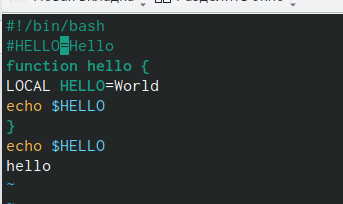

---
## Front matter
lang: ru-RU
title: Лабораторная работа №8
subtitle: Командная оболочка Midnight Commander
author:
  - Зарифбеков А. П.
institute:
  - Российский университет дружбы народов, Москва, Россия
date: 29 марта 2023

## i18n babel
babel-lang: russian
babel-otherlangs: english

## Formatting pdf
toc: false
toc-title: Содержание
slide_level: 2
aspectratio: 169
section-titles: true
theme: metropolis
header-includes:
 - \metroset{progressbar=frametitle,sectionpage=progressbar,numbering=fraction}
 - '\makeatletter'
 - '\beamer@ignorenonframefalse'
 - '\makeatother'
---

## Докладчик

 * Зарифбеков Амир Пайшанбиевич
 *  Студент НБИбд-01-22
 * Российский университет дружбы народов
  
## Актуальность

Актуально для тех кто хочет освоитьтекстовый редактор vi

## Объект и предмет исследования

- Презентация как текст
- Программное обеспечение для создания презентаций
- Входные и выходные форматы презентаций

## Цели и задачи

- Познакомиться с операционной системой Linux. Получить практические навыки рабо-
ты с редактором vi, установленным по умолчанию практически во всех дистрибутивах.

-  Создание нового файла с использованием vi

-  Редактирование существующего файла

## Содержание исследования

- Создание нового файла с использованием vi
 
1. Создаv каталог с именем ~/work/os/lab06.

{#fig:001 width=70%}

##

2. Перейдём  во вновь созданный каталог.

{#fig:002 width=70%}

##

3. Вызовим vi и создайте файл hello.sh

{#fig:003 width=70%}

##

4. Нажмём клавишу i и вводите следующий текст.
 
{#fig:004 width=70%}

##

5. Нажмём : для перехода в режим последней строки и внизу вашего экрана появится
приглашение в виде двоеточия

{#fig:005 width=70%}

##

6.  Нажмём w (записать) и q (выйти), а затем нажмите клавишу Enter для сохранения
вашего текста и завершения работы.

{#fig:007 width=70%}

##

7. Сделаем файл исполняемым
{#fig:008 width=70%}

##

- Редактирование существующего файла

1. Вызовим vi на редактирование файла

{#fig:011 width=70%}

##

2. Утановим курсор в конец слова HELL второй строки.
 
{#fig:012 width=70%}

##

3. Длее с введёным нами текстом проводим разные операции с помошью клавишь , вставляем его удаляем и в конце концов сохраняем все изменеия.

{#fig:013width=70%}

## Результаты

Мы познакомились с  операционной системой Linux. Получили практические навыки работы с редактором vi, установленным по умолчанию практически во всех дистрибутивах

