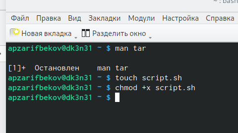
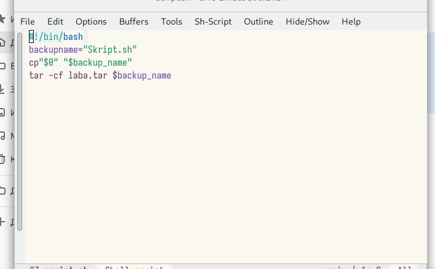
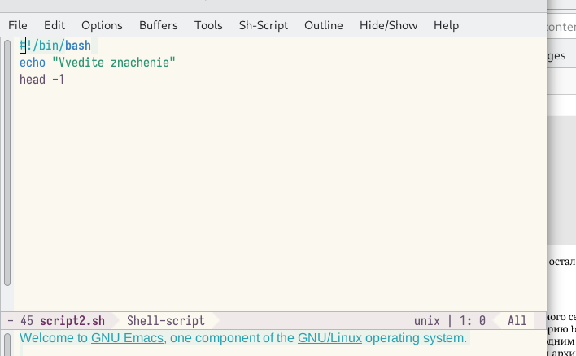
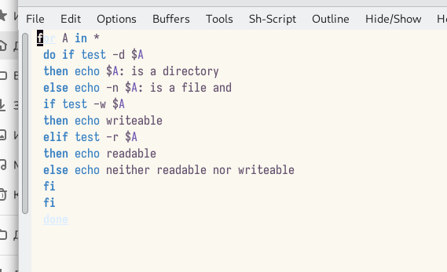
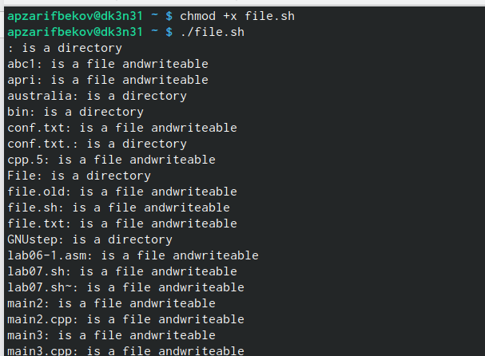
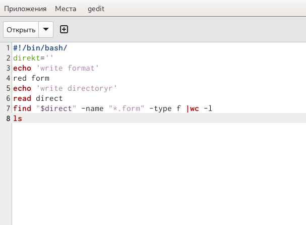
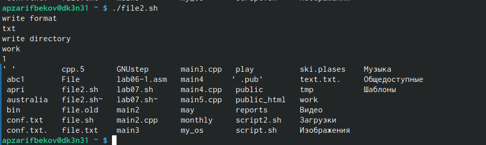

---
## Front matter
lang: ru-RU
title: Лабораторная работа №10
subtitle: Программирование в командном процессоре ОС UNIX. Командные файлы
author:
  - Зарифбеков А. П.
institute:
  - Российский университет дружбы народов, Москва, Россия
date: 13 апреля 2023

## i18n babel
babel-lang: russian
babel-otherlangs: english

## Formatting pdf
toc: false
toc-title: Содержание
slide_level: 2
aspectratio: 169
section-titles: true
theme: metropolis
header-includes:
 - \metroset{progressbar=frametitle,sectionpage=progressbar,numbering=fraction}
 - '\makeatletter'
 - '\beamer@ignorenonframefalse'
 - '\makeatother'
---

## Докладчик

 * Зарифбеков Амир Пайшанбиевич
 *  Студент НБИбд-01-22
 * Российский университет дружбы народов

## Актуальность

- Актуально для тех кто хочет изучить програмирование в комамндном процессоре ОС UNIX и командные файлы

## Объект и предмет исследования

- Презентация как текст
- Программное обеспечение для создания презентаций
- Входные и выходные форматы презентаций

## Цели и задачи

- Изучить основы программирования в оболочке ОС UNIX/Linux. Научиться писать
небольшие командные файлы.
- Изучить основы программирования в оболочке ОС UNIX/Linux. Научиться писать
небольшие командные файлы.
- Написать скрипт, который при запуске будет делать резервную копию самого себя (то
есть файла, в котором содержится его исходный код) в другую директорию backup
в вашем домашнем каталоге. При этом файл должен архивироваться одним из ар-
хиваторов на выбор zip, bzip2 или tar. Способ использования команд архивации
необходимо узнать, изучив справку.
-  Написать пример командного файла, обрабатывающего любое произвольное число
аргументов командной строки, в том числе превышающее десять. Например, скрипт
может последовательно распечатывать значения всех переданных аргументов.
-  Написать командный файл — аналог команды ls (без использования самой этой ко-
манды и команды dir). Требуется, чтобы он выдавал информацию о нужном каталоге
и выводил информацию о возможностях доступа к файлам этого каталога.
-  Написать командный файл, который получает в качестве аргумента командной строки
формат файла (.txt, .doc, .jpg, .pdf и т.д.) и вычисляет количество таких файлов
в указанной директории. Путь к директории также передаётся в виде аргумента ко-
мандной строки.

## Содержание исследования

1. Написал скрипт, который при запуске будет делать резервную копию самого себя (то
есть файла, в котором содержится его исходный код) в другую директорию backup в нашем домашнем каталоге.

{#fig:001 width=70%}

##

{#fig:002 width=70%}

##

2. Написал пример командного файла, обрабатывающего любое произвольное число аргументов командной строки, в том числе превышающее десять

{#fig:003 width=70%}

##

{#fig:004 width=70%}

##

3. Написал командный файл — аналог команды ls 

{#fig:005 width=70%}

##

{#fig:006 width=70%}

##

4. Написал командный файл, который получает в качестве аргумента командной строки
формат файла и вычисляет количество таких файлов в указанной директории. 
 
{#fig:007 width=70%}

##

{#fig:008 width=70%}

## Результаты

- Я изучил основы программирования в оболочке ОС UNIX/Linux. Научился писать небольшие командные файлы

