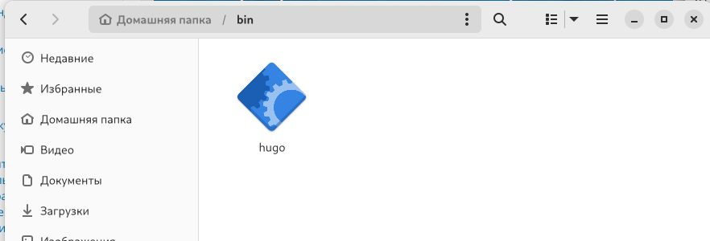
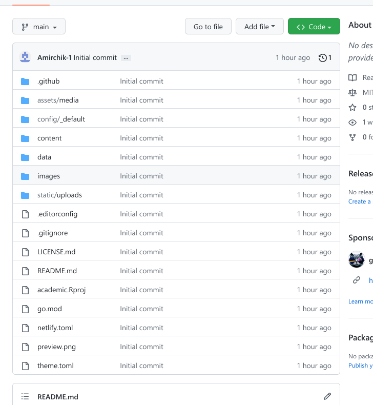
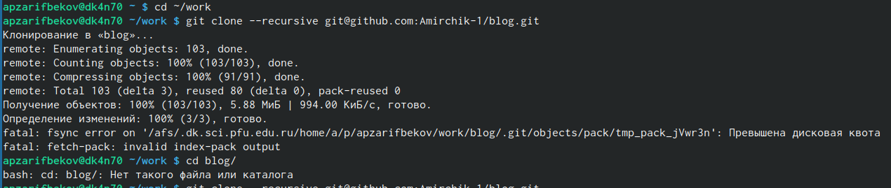
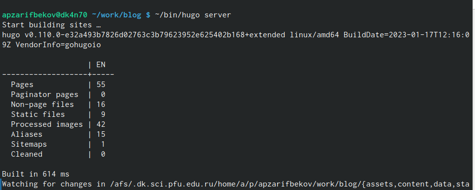
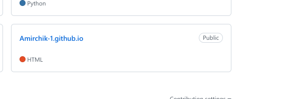
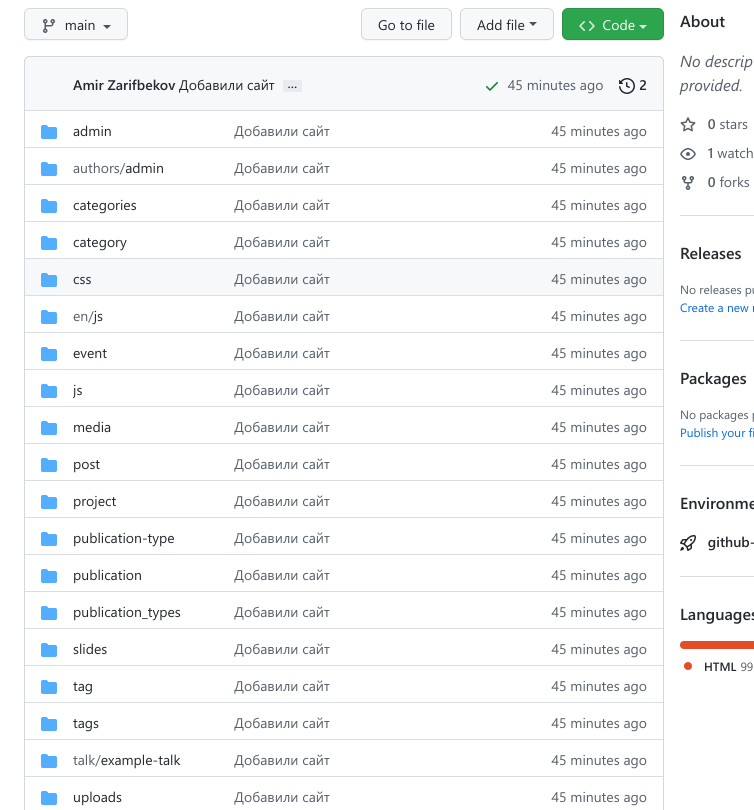
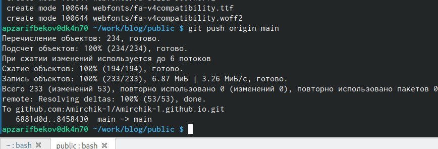
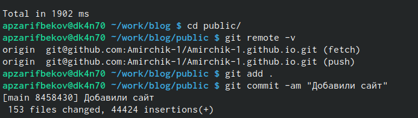

---
## Front matter
lang: ru-RU
title:  Индивидуальный проект 
subtitle: первый этап
author:
  - зарифбеков А. П.
institute:
  - Российский университет дружбы народов, Москва, Россия
  - 
date: 22 Февраля 2023

## i18n babel
babel-lang: russian
babel-otherlangs: english

## Formatting pdf
toc: false
toc-title: Содержание
slide_level: 2
aspectratio: 169
section-titles: true
theme: metropolis
header-includes:
 - \metroset{progressbar=frametitle,sectionpage=progressbar,numbering=fraction}
 - '\makeatletter'
 - '\beamer@ignorenonframefalse'
 - '\makeatother'
---

# Информация

## Докладчик

  * Зарифбеков Амир Пайшанбиевич 
  * Студент НБИбд-01-22
  * Российский университет дружбы народов

## Актуальность

- Актуально для тех кто хочет создавать сайты 
- Для тех кто хочет научится создавать сайты через Github
- Необходимо создавать сайты быстро
- Желательна минимизация усилий для создания сайта

## Объект и предмет исследования

- Презентация как текст
- Программное обеспечение для создания презентаций
- Входные и выходные форматы презентаций

## Цели и задачи

- Установить необходимое программное обеспечение.
- Скачать шаблон темы сайта.
- Разместить его на хостинге git.
- Установить параметр для URLs сайта.
- Разместить заготовку сайта на Github pages.

## Содержание исследования

1. Первым делом скачиваем архив hugo, который соотвествует вашей ОС, создаем папку bin и переносим файл hugo в созданную папку.

{#fig:001 width=90%}

2. Создаем репозиторий на основе шаблона в ТУИС.

{#fig:002 width=90%}

3. Клонируем шаблонный репозиторий в личный с помощью команды git clone

{#fig:003 width=70%}

4. Просматриваем подкаталоги ~/bin/hugo и с помощью команды server получаем ссылку на шаблон сайта

{#fig:004 width=90%}

5. Создаем еще один репозиторий для того, чтобы сайт можно было открыть с любого ПК
.
{#fig:005 width=90%}

6. Снова клонируем ново-созданный репозиторий, переключаемся на ветку main, создаем файл md и выгружаем нововведения на github

{#fig:006 width=90%}

7. Переносим всю информацию на основную ветку с помощью команды git push origin main, добавляем новые подкаталоги на гитхаб, восстановив папку public 

{#fig:0 width=90%}

8. Проверяем привязку двух репозиториев к гитхабу и нашему профилю, обновляем репозиторий

{#fig:008 width=90%}

9. Заходим на личный сайт! 

{#fig:009 width=90%}

## Результаты

- Установил необходимое программное обеспечение.
- Скачал шаблон темы сайта.
- Разместил его на хостинге git.
- Установил параметр для URLs сайта.
- Разместил заготовку сайта на Github pages.

## Итоговый слайд

- Мы создали заготовки для сайта и разместили их на Github pages 

# Рекомендации

## Принцип 10/20/30

  - 10 слайдов
  - 20 минут на доклад
  - 30 кегль шрифта

## Связь слайдов

::: incremental

- Один слайд --- одна мысль
- Нельзя ссылаться на объекты, находящиеся на предыдущих слайдах (например, на формулы)
- Каждый слайд должен иметь заголовок

:::

## Количество сущностей

::: incremental

- Человек может одновременно помнить $7 \pm 2$ элемента
- При размещении информации на слайде старайтесь чтобы в сумме слайд содержал не более 5 элементов
- Можно группировать элементы так, чтобы визуально было не более 5 групп

:::

## Общие рекомендации

::: incremental

- На слайд выносится та информация, которая без зрительной опоры воспринимается хуже
- Слайды должны дополнять или обобщать содержание выступления или его частей, а не дублировать его
- Информация на слайдах должна быть изложена кратко, чётко и хорошо структурирована
- Слайд не должен быть перегружен графическими изображениями и текстом
- Не злоупотребляйте анимацией и переходами

:::

## Представление данных

::: incremental

- Лучше представить в виде схемы
- Менее оптимально представить в виде рисунка, графика, таблицы
- Текст используется, если все предыдущие способы отображения информации не подошли

:::

