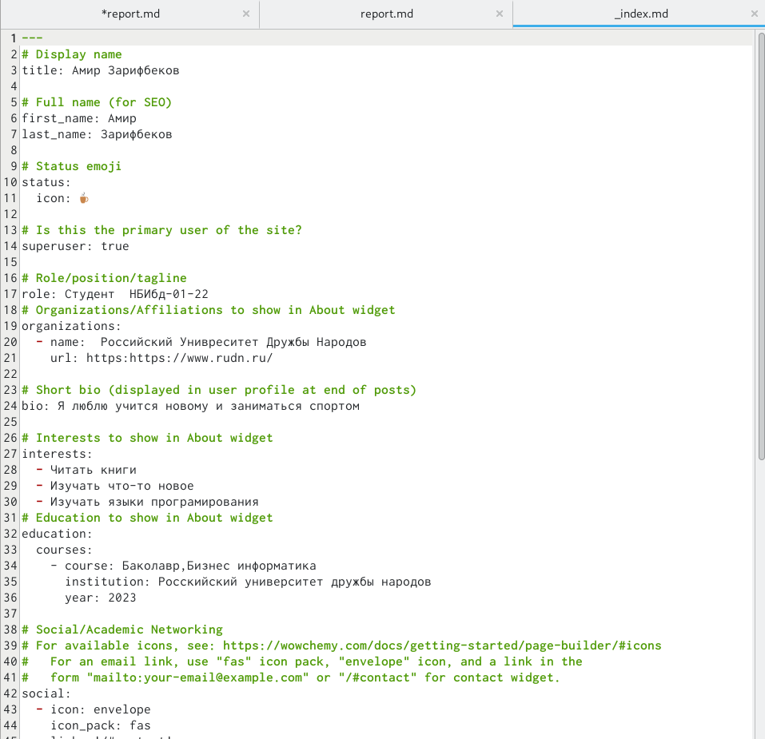
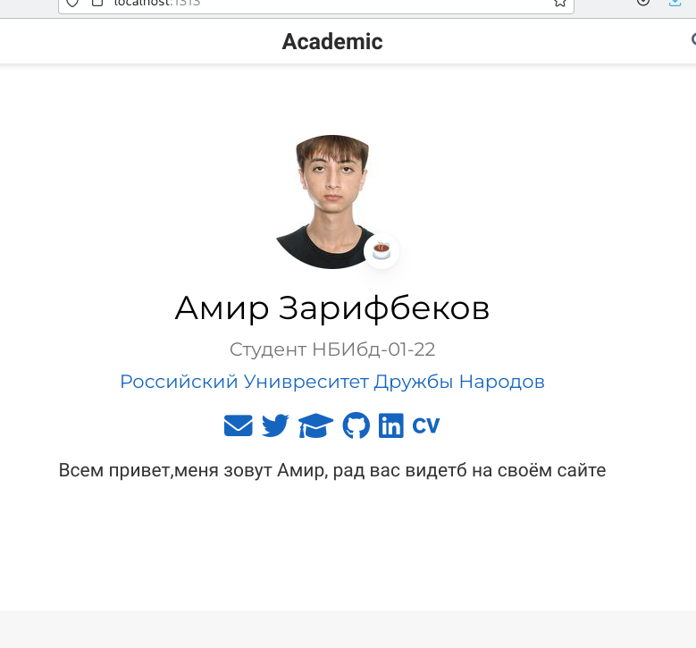
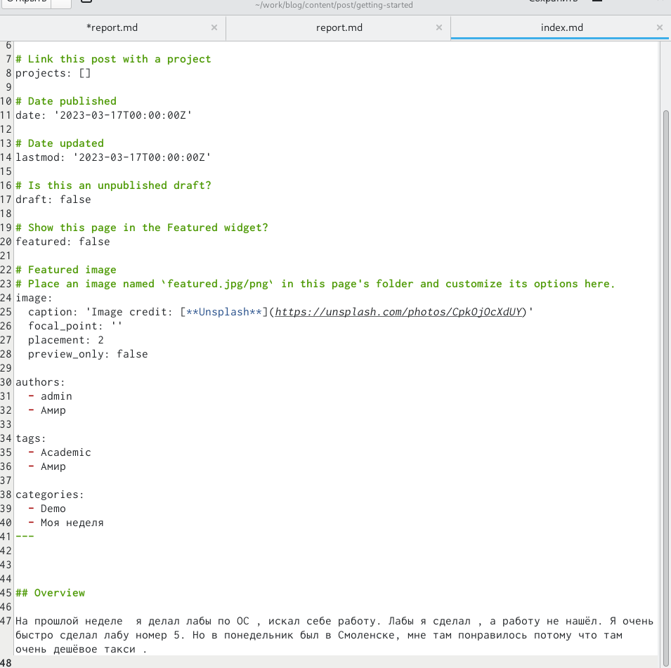
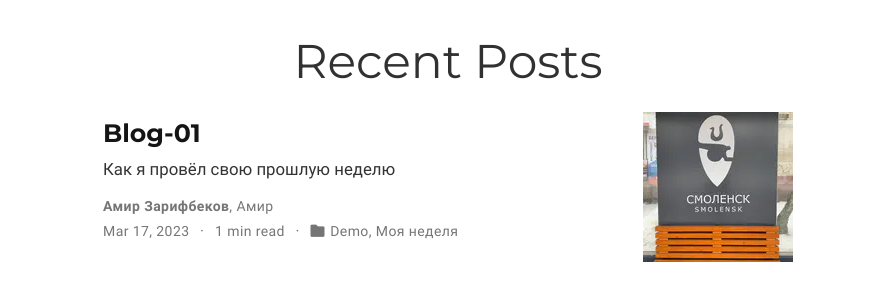
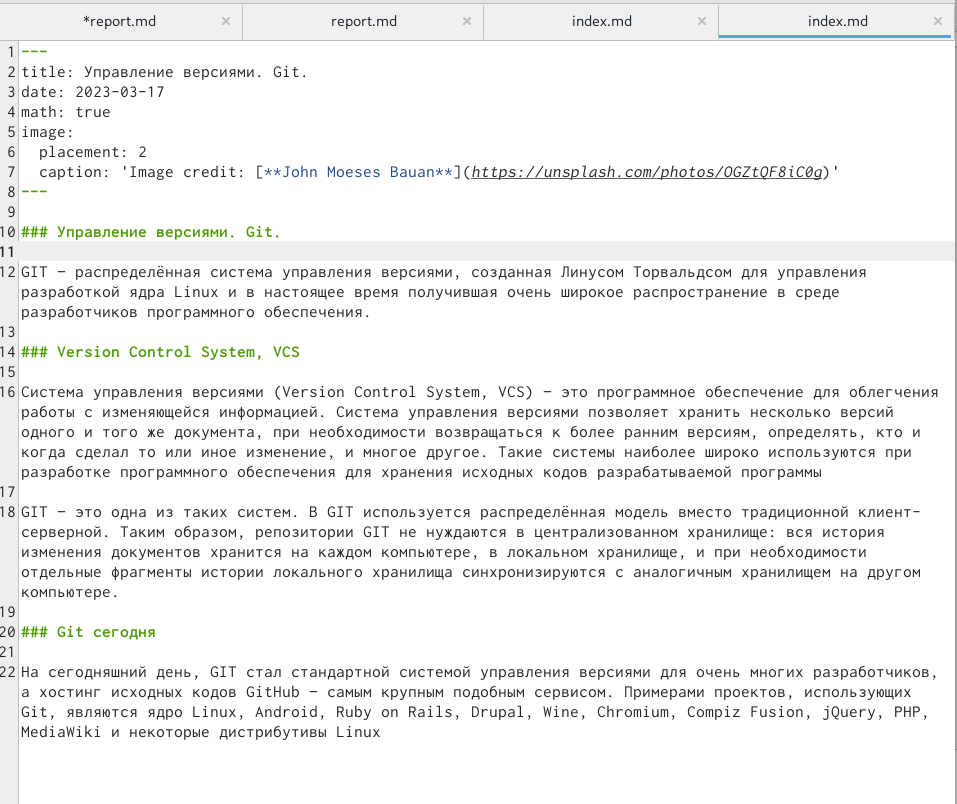
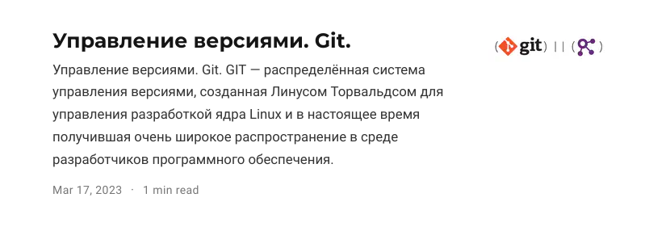

---
## Front matter
lang: ru-RU
title:  Индивидуальный проект 
subtitle: первый этап
author:
  - Зарифбеков А. П.
institute:
  - Российский университет дружбы народов, Москва, Россия
  - 
date: 17 марта 2023

## i18n babel
babel-lang: russian
babel-otherlangs: english

## Formatting pdf
toc: false
toc-title: Содержание
slide_level: 2
aspectratio: 169
section-titles: true
theme: metropolis
header-includes:
 - \metroset{progressbar=frametitle,sectionpage=progressbar,numbering=fraction}
 - '\makeatletter'
 - '\beamer@ignorenonframefalse'
 - '\makeatother'
---

# Информация

## Докладчик

  * Зарифбеков Амир Пайшанбиевич 
  * Студент НБИбд-01-22
  * Российский университет дружбы народов

## Актуальность

- Актуально для тех кто хочет научитбся модернезиовать свой сайт 

## Объект и предмет исследования

- Презентация как текст
- Программное обеспечение для создания презентаций
- Входные и выходные форматы презентаций

## Цели и задачи

- Научится добовлять на сайт данные о себе , делать посты и модернезировать их . 
- Разместить фотографию владельца сайта.
- Разместить краткое описание владельца сайта (Biography).
- Добавить информацию об интересах (Interests).
- Добавить информацию от образовании (Education).
- Сделать пост по прошедшей неделе.
- Добавить пост на тему по выбору.

## Содержание исследования

1. Разметим  свою фотографию , краткое описание , а так же информацию об интересах и образование

{#fig:001 width=90%}

##

{#fig:002 width=90%}

##

2. Сделаем пост по прошедшей неделе 

{#fig:003 width=90%}

##

{#fig:004 width=90%}

##

3. Сделаю пост на тему: управление версиями. Git.

{#fig:005 width=70%}

##

{#fig:006 width=70%}

## Результаты

- Я научился добовлять на сайт данные осебе , делать посты и модернезировать их.
