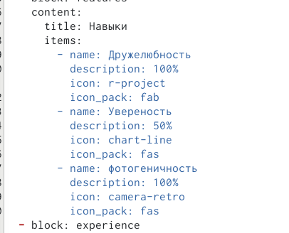

---
## Front matter
lang: ru-RU
title:  Индивидуальный проект 
subtitle: Третий этап
author:
  - Зарифбеков А. П.
institute:
  - Российский университет дружбы народов, Москва, Россия
  - 
date: 5 апреля 2023

## i18n babel
babel-lang: russian
babel-otherlangs: english

## Formatting pdf
toc: false
toc-title: Содержание
slide_level: 2
aspectratio: 169
section-titles: true
theme: metropolis
header-includes:
 - \metroset{progressbar=frametitle,sectionpage=progressbar,numbering=fraction}
 - '\makeatletter'
 - '\beamer@ignorenonframefalse'
 - '\makeatother'
---

## Докладчик

  * Зарифбеков Амир Пайшанбиевич 
  * Студент НБИбд-01-22
  * Российский университет дружбы народов

## Актуальность

- Актуально для тех кто хочет научиться добовлять информацию о соих достижениях к сайту 

## Объект и предмет исследования

- Презентация как текст
- Программное обеспечение для создания презентаций
- Входные и выходные форматы презентаций

## Цели и задачи

- Добавить информацию о своих навыках
- Дбавить информацию о опыте
- Добавить информацию о достижениях
- Сделать пост по предедущей неделе
- Добавить пост на тему по выбору

## Содержание исследования

1. Добавим о себе информацию о своих навыках на сайт 

{#fig:001 width=90%}

##

{#fig:002 width=90%}

##

2. Добавим информмацю об опыте на сайт 

{#fig:003 width=90%}

##

{#fig:004 width=90%}

##

3. Добавим информацию о достижениях на сайт 

{#fig:005 width=70%}

##

{#fig:006 width=70%}

##

4. Сделаю пост по прошедшей неделе.

{#fig:007 width=90%}

##

{#fig:008 width=90%}

##

5. Сделаю пост на тему язык разметки Markdown

{#fig:009 width=90%}

##

{#fig:010 width=90%}

## Результаты

- Добавил информацию о своих навыках 
- добавил информацию об опыте 
- Добавил информацию о достижениях 
- Сделал пост по прошедшей неделе
- Добавил пост на тему по выбору

