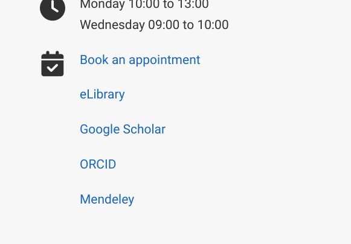
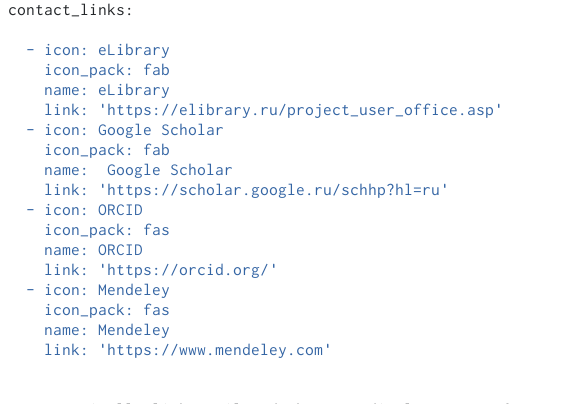
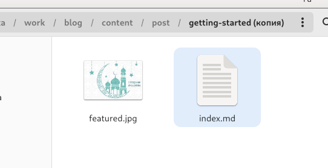
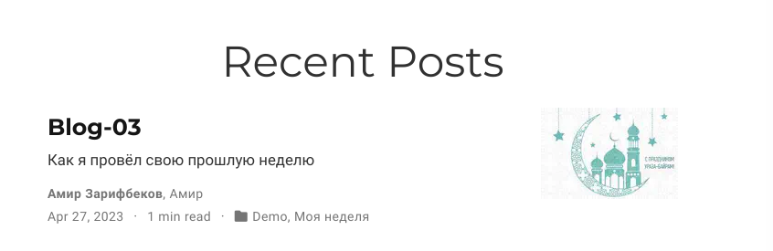
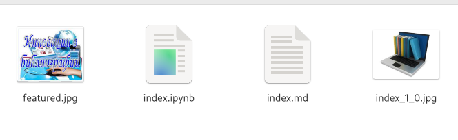
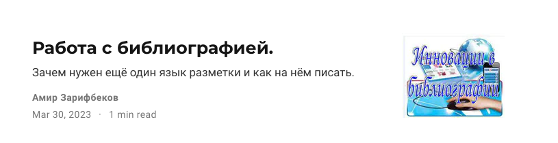

---
## Front matter
lang: ru-RU
title:  Индивидуальный проект 
subtitle: Четвёртый этап
author:
  - Зарифбеков А. П.
institute:
  - Российский университет дружбы народов, Москва, Россия
  - 
date: 27 апреля 2023

## i18n babel
babel-lang: russian
babel-otherlangs: english

## Formatting pdf
toc: false
toc-title: Содержание
slide_level: 2
aspectratio: 169
section-titles: true
theme: metropolis
header-includes:
 - \metroset{progressbar=frametitle,sectionpage=progressbar,numbering=fraction}
 - '\makeatletter'
 - '\beamer@ignorenonframefalse'
 - '\makeatother'
---

## Докладчик

  * Зарифбеков Амир Пайшанбиевич 
  * Студент НБИбд-01-22
  * Российский университет дружбы народов

## Актуальность

- Актуально для тех кто хочет Научиться добовлять к сайту ссылку на научные и бибилиометрические ресурсы

## Объект и предмет исследования

- Презентация как текст
- Программное обеспечение для создания презентаций
- Входные и выходные форматы презентаций

## Цели и задачи

- Зарегестрироватьтся на сайтах 
- Создать отчёт по прошедшей неделе 
- Сделать отчйт на выбранную тему 

## Содержание исследования

1. регестрируемся на чайтах котрые даны нам в задании 

{#fig:001 width=90%}

##

{#fig:002 width=90%}

##

2. Сделал пост по прошедшей неделе 

{#fig:003 width=90%}

##

{#fig:004 width=90%}

##

3. Сделаю пост по теме работа с библиографией

{#fig:005 width=70%}

##

{#fig:006 width=70%}

## Результаты

- Зарегестрировался на сайтах 
- Создал отчёт по прошедшей неделе 
- Сделал отчёт на выбранную тему 

